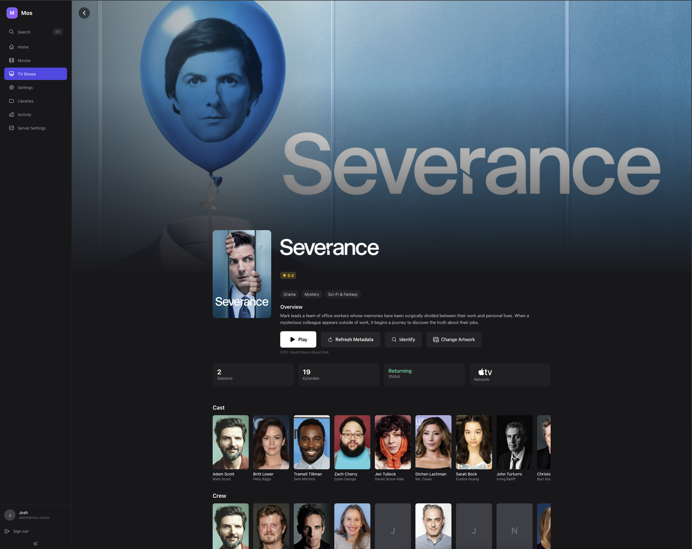

<h1 align="center"><strong>dubby</strong></h1>

  <strong>Self-hosted streaming, built with care.</strong>

  A modern media server with reliable playback, clean design, and respect for your privacy. 
  No ads. No hardware tax. Free for local use.

  
  &nbsp;
  

  

---

## What dubby gets right

- **Playback Reliability** — Seven playback tiers from direct play to full transcode. dubby always finds a working mode — it never says "format not supported."

- **Library Integrity** — Your media library is your investment. Deterministic ingest, clear matching logic, no silent mutations.

- **Private by Default** — No ads. No data selling. Telemetry is opt-out and transparent. Your server, your data.

- **Full Quality Playback** — HEVC, AV1, HDR10, Dolby Vision. Passthrough for TrueHD, DTS-HD MA, and Atmos. Your library in the quality it deserves.

- **Native TV Apps** — Apple TV and Android TV apps with native playback, D-pad navigation, and HDR support. Not a web wrapper.

- **Hardware Transcoding** — Intel QSV, NVIDIA NVENC, AMD VAAPI, Apple VideoToolbox. Full GPU transcoding with no paywall.

- **Subtitles** — Embedded extraction, sidecar file detection, OpenSubtitles download. SRT, ASS, PGS, VobSub — with language preferences and burn-in.

- **Auto Metadata** — TMDB, TVDB, and OpenSubtitles integration. Artwork, cast, ratings, and subtitles fetched automatically.

- **Multi-User** — Separate profiles with individual watch progress, language preferences, and library permissions.

  

---

## How dubby compares

|  | dubby | Plex | Emby | Jellyfin |
|---|:---:|:---:|:---:|:---:|
| Free for local use | :white_check_mark: | :white_check_mark: | :heavy_minus_sign: | :white_check_mark: |
| No ads or tracking | :white_check_mark: | :x: | :heavy_minus_sign: | :white_check_mark: |
| HW transcoding included | :white_check_mark: | :x: | :x: | :white_check_mark: |
| Modern, polished UI | :white_check_mark: | :heavy_minus_sign: | :x: | :x: |
| Native TV apps | :white_check_mark: | :white_check_mark: | :white_check_mark: | :heavy_minus_sign: |
| HDR & Dolby Vision | :white_check_mark: | :heavy_minus_sign: | :heavy_minus_sign: | :heavy_minus_sign: |
| Privacy by default | :white_check_mark: | :x: | :heavy_minus_sign: | :white_check_mark: |
| Adaptive playback engine | :white_check_mark: | :x: | :x: | :x: |
| Skip intro (free) | :white_check_mark: | :x: | :x: | :heavy_minus_sign: |

Comparison accurate as of February 2026.

---

## Links

- **Website** — [dubby.tv](https://dubby.tv)
- **Newsletter** — [Weekly dev updates](https://dubby.tv/#newsletter)
- **Contact** — [hello@dubby.tv](mailto:hello@dubby.tv)
