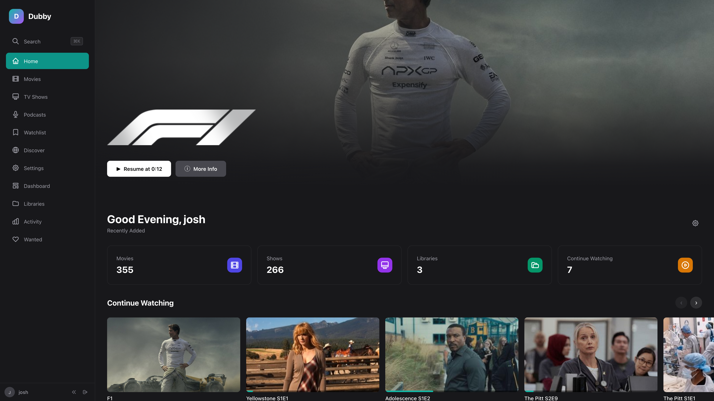
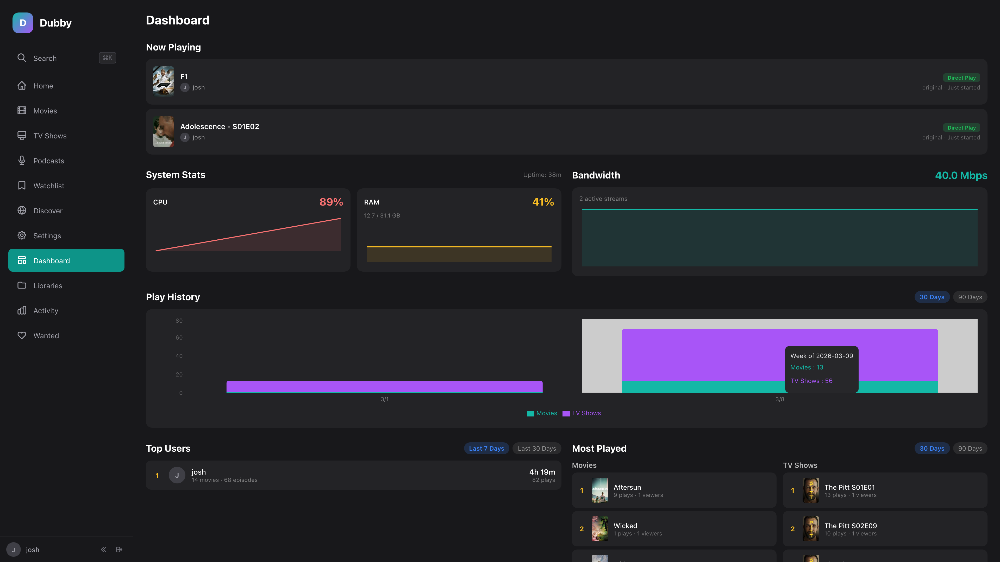

<h1 align="center"><strong>dubby</strong></h1>

<p align="center">
  <strong>Self-hosted streaming, built with care.</strong>
</p>

<p align="center">
  A modern media server with reliable playback, clean design, and respect for your privacy.<br>
  No ads. No hardware tax. Free for local use.
</p>

<p align="center">
  
  &nbsp;
  <a href="https://dubby.tv"></a>
</p>

<p align="center">
  
</p>

---

> [!CAUTION]
> **Alpha Software** — Dubby is early-stage software under active development. Expect bugs, incomplete features, and breaking changes between updates.
>
> **AI-Assisted Development** — Significant portions of this codebase were developed with AI assistance. While we strive for quality, the code has not been fully human-reviewed.
>
> **Not Security Audited** — This software has not been professionally pen-tested or security audited. Do not expose it to the public internet.
>
> **Data Loss Possible** — Database schema may change between versions. Migrations may not always be smooth. Keep backups of anything you value.
>
> **No Warranty** — This software is provided as-is with no warranty of any kind. Use at your own risk.

---

## What dubby gets right

- **Plays Everything** — Seven playback tiers from direct play to full transcode. dubby always finds a working mode — no "format not supported" screens, ever.

- **HDR & Dolby Vision** — HDR10, Dolby Vision, HLG passthrough with automatic tone-mapping fallback. TrueHD and Atmos audio pass straight through.

- **Skip Intro & Credits** — Audio fingerprinting detects intros across episodes automatically. One tap to skip — no subscription required.

- **Seek Preview Thumbnails** — Scrub through any file and see exactly where you are. Trickplay sprites generated automatically — free, not behind a paywall.

- **Native TV Apps** — Apple TV and Android TV apps built with native playback engines, D-pad navigation, and full HDR support. Not a web wrapper.

- **GPU Transcoding, No Paywall** — Intel QSV, NVIDIA NVENC, AMD VAAPI, Apple VideoToolbox. Full hardware acceleration included for every user.

- **Discover & Request** — Browse trending content and request new movies or shows directly from the app. Built-in Seerr integration — no extra setup.

- **Smart Metadata** — TMDB, TVDB, Trakt, and MDBList enrichment. Artwork, cast, ratings, and subtitles fetched and organized automatically.

- **Ahead-of-Time Optimization** — Pre-transcode your library for instant playback on any device. A smart coverage matrix builds the minimum set of variants needed.

- **Backup & Restore** — Scheduled backups with retention policies. Download archives, upload to a new server, restore with one click.

- **Multi-User Profiles** — Separate watch progress, language preferences, and library permissions per user. Invite-only registration with role-based access.

- **Private by Default** — No ads. No data selling. No cloud account required. Telemetry is opt-out and transparent. Your server, your rules.

<p align="center">
  
</p>

---

## Screenshots

<p align="center">
  
</p>

<p align="center">
  
</p>

<p align="center">
  
</p>

<p align="center">
  
</p>

---

## Quick Start

```yaml
services:
  dubby:
    image: dubbytv/dubby:beta
    ports:
      - "3000:3000"
    environment:
      - BETTER_AUTH_SECRET=${BETTER_AUTH_SECRET:?Set BETTER_AUTH_SECRET in .env}
      - TMDB_API_KEY=${TMDB_API_KEY:-}
      - REDIS_URL=redis://valkey:6379
    volumes:
      - dubby-data:/data
      - dubby-cache:/cache
      - /path/to/media:/media:ro
    depends_on:
      valkey:
        condition: service_healthy

  valkey:
    image: valkey/valkey:latest
    volumes:
      - valkey-data:/data
    healthcheck:
      test: ['CMD', 'valkey-cli', 'ping']
      interval: 10s
      timeout: 5s
      retries: 3

volumes:
  dubby-data:
  dubby-cache:
  valkey-data:
```

```bash
# Generate a secret
echo "BETTER_AUTH_SECRET=$(openssl rand -base64 32)" > .env

# Start
docker compose up -d

# Open http://localhost:3000
```

---

## How dubby compares

|  | dubby | Plex | Emby | Jellyfin |
|---|:---:|:---:|:---:|:---:|
| **Philosophy** | | | | |
| Free for local use | :white_check_mark: | :white_check_mark: | :heavy_minus_sign: <sup>1</sup> | :white_check_mark: |
| No ads or tracking | :white_check_mark: | :x: <sup>2</sup> | :heavy_minus_sign: <sup>3</sup> | :white_check_mark: |
| Privacy by default | :white_check_mark: | :x: <sup>4</sup> | :heavy_minus_sign: <sup>5</sup> | :white_check_mark: |
| Open source | :x: | :x: | :x: <sup>6</sup> | :white_check_mark: |
| Modern, polished UI | :white_check_mark: | :heavy_minus_sign: <sup>7</sup> | :x: <sup>8</sup> | :x: <sup>9</sup> |
| **Playback** | | | | |
| Adaptive playback engine | :white_check_mark: <sup>10</sup> | :x: | :x: | :x: |
| HDR & Dolby Vision | :white_check_mark: | :heavy_minus_sign: <sup>11</sup> | :heavy_minus_sign: <sup>12</sup> | :heavy_minus_sign: <sup>13</sup> |
| HDR tone-mapping (free) | :white_check_mark: <sup>14</sup> | :x: <sup>15</sup> | :x: <sup>16</sup> | :white_check_mark: |
| HW transcoding included | :white_check_mark: <sup>17</sup> | :x: <sup>15</sup> | :x: <sup>16</sup> | :white_check_mark: |
| Trickplay previews (free) | :white_check_mark: | :x: <sup>15</sup> | :x: <sup>16</sup> | :white_check_mark: |
| Skip intro (free) | :white_check_mark: <sup>18</sup> | :x: <sup>15</sup> | :x: <sup>16</sup> | :heavy_minus_sign: <sup>19</sup> |
| **Platform** | | | | |
| Native TV apps | :white_check_mark: <sup>20</sup> | :white_check_mark: | :white_check_mark: | :heavy_minus_sign: <sup>21</sup> |
| **Features** | | | | |
| Media requests built-in | :white_check_mark: <sup>22</sup> | :x: <sup>23</sup> | :x: | :x: <sup>24</sup> |
| Ahead-of-time optimization | :white_check_mark: <sup>25</sup> | :heavy_minus_sign: <sup>26</sup> | :x: | :x: |
| Podcast support | :white_check_mark: | :x: <sup>27</sup> | :x: | :x: |
| Backup & restore | :white_check_mark: <sup>28</sup> | :x: <sup>29</sup> | :heavy_minus_sign: <sup>30</sup> | :x: <sup>31</sup> |
| Prometheus monitoring | :white_check_mark: <sup>32</sup> | :x: <sup>33</sup> | :x: | :x: <sup>34</sup> |

<details>
<summary>Notes</summary>

1. 1-minute playback limit on mobile and desktop apps without Emby Premiere
2. Ad-supported streaming in the UI; collects usage data with limited opt-out
3. No third-party ads, but server phones home to mb3admin.com for license checks
4. Cloud auth required even locally; 2025 privacy policy allows data selling with opt-out
5. No library data collected, but closed source makes claims unverifiable
6. Went closed-source in 2018 (which led to the Jellyfin fork)
7. 2025 redesign is modern but controversial — usability regressions on TV
8. Functional but widely considered dated by the community
9. Usable but rough edges; improving with new experimental layout
10. 7-tier playback hierarchy — always finds a working mode
11. HDR10 direct play works; DV passthrough on select devices; HDR→SDR tone mapping requires Plex Pass
12. HDR10 direct play works; Dolby Vision passthrough is inconsistent; no DV tone mapping
13. HDR10 direct play works; DV passthrough only via direct play with known client bugs
14. GPU-accelerated with CUDA, VAAPI, OpenCL, and software fallback
15. Requires Plex Pass
16. Requires Emby Premiere
17. QSV, NVENC, VAAPI, and VideoToolbox with no paywall
18. Audio fingerprinting and chapter-based detection built-in
19. Available as a free community plugin, not built into the server
20. Native Apple TV (tvOS) and Android TV apps with custom OSD and HDR support
21. Android TV app is solid; Apple TV (Swiftfin) is still immature
22. Integrated Seerr-powered discover and request workflow
23. Requires third-party tools like Overseerr
24. Requires third-party tools like Jellyseerr
25. Smart coverage matrix pre-transcodes optimal variants per device category
26. Basic "Optimize" feature creates single-quality variants
27. Podcast feature was removed in 2023
28. Scheduled backups with retention policies, download, upload, and one-click restore
29. Manual database backup only — no built-in UI or scheduling
30. Basic backup/restore in settings
31. Manual database copy only
32. Built-in OpenTelemetry metrics with Prometheus exporter
33. Requires third-party tools like Tautulli
34. Requires third-party tools

</details>

<sub>Comparison accurate as of March 2026. Features may change as all projects evolve.</sub>

---

## Supported Platforms

| Architecture | Available |
|---|:---:|
| x86-64 (amd64) | :white_check_mark: |
| arm64 (Apple Silicon, RPi) | :white_check_mark: |

---

## Links

- **Website** — [dubby.tv](https://dubby.tv)
- **Newsletter** — [Weekly dev updates](https://dubby.tv/#newsletter)
- **Contact** — [woof@dubby.tv](mailto:woof@dubby.tv)
